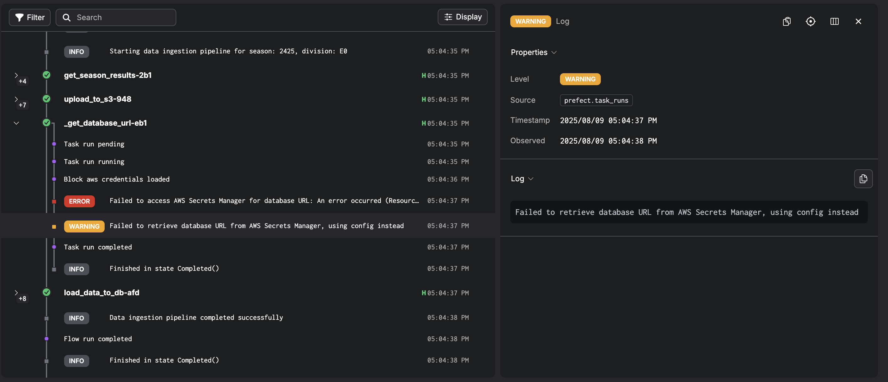
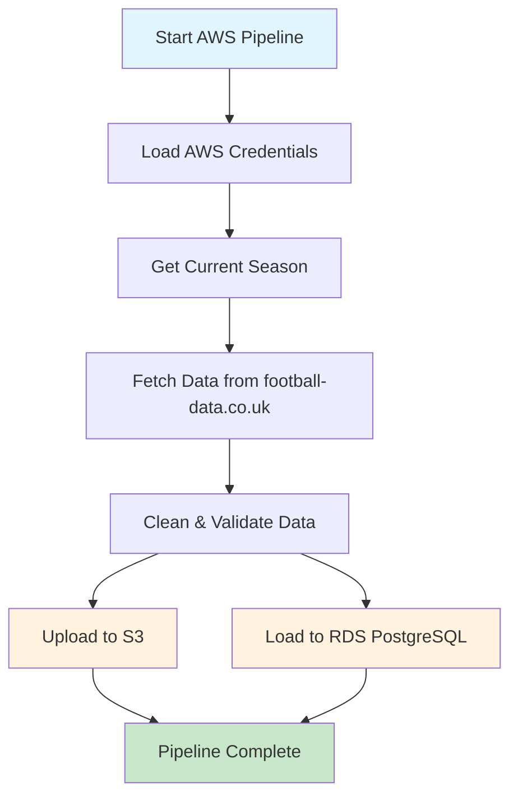
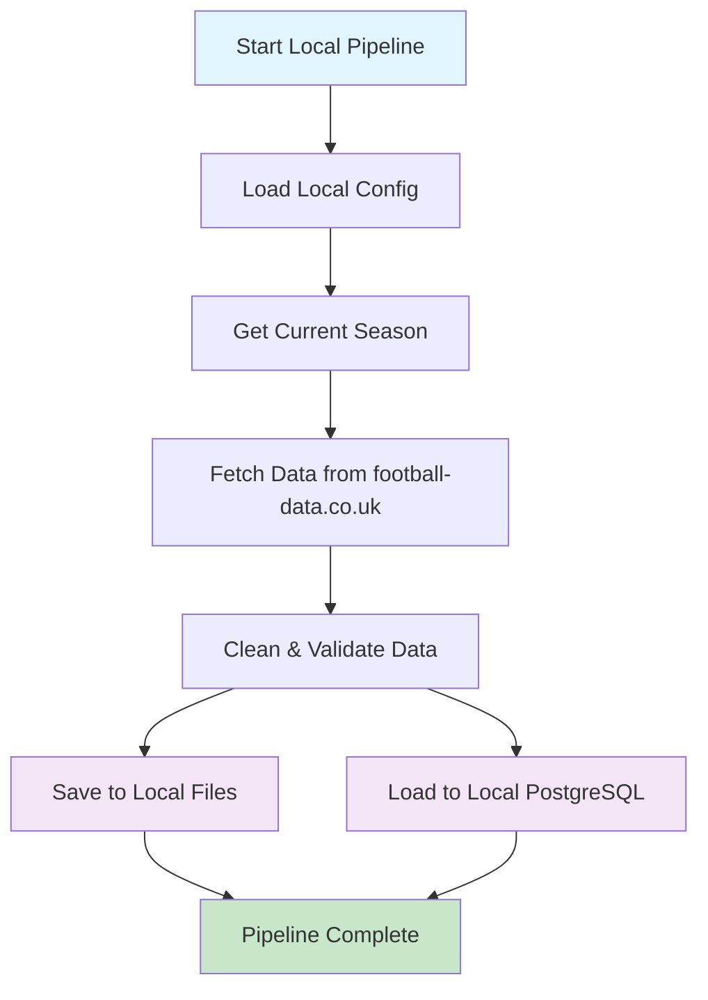

# Data Ingestion Pipelines

This module implements robust data ingestion pipelines using Prefect for orchestration, supporting both local and AWS cloud deployments with comprehensive error handling, caching, and monitoring capabilities.

## Pipeline Architecture

The data ingestion system consists of:
- **AWS Pipeline** (`data_ingestion_aws.py`): Cloud-based ingestion with S3 storage and RDS
- **Local Pipeline** (`data_ingestion_local.py`): Local development with file storage and PostgreSQL
- **Common Tasks** (`data_ingestion_common_tasks.py`): Shared functions for data fetching, cleaning, and database operations
- **Backfill System** (`data_ingestion_backfills.py`): Historical data processing for multiple seasons

## Pipeline Structure

```
├── README.md
├── __init__.py
├── prefect_config.py
├── data_ingestion
│   ├── __init__.py
│   ├── data_ingestion_aws.py
│   ├── data_ingestion_backfills.py
│   ├── data_ingestion_common_tasks.py
│   └── data_ingestion_local.py
├── training
│   └── training_pipeline.py
└── utils
    ├── __init__.py
    ├── helpers.py
    ├── hooks.py
    └── schema_analysis.py
```

## Pipeline Dependencies

### Prefect Variables & Credentials Setup

The pipelines require specific Prefect variables and AWS credentials to be configured. There are three ways to set these up:

#### Method 1: Automated with Terraform (Recommended for Production)

```bash
# Deploy AWS infrastructure and configure Prefect automatically
make prefect-config-vars && make prefect-managed-pool
```

**What this does:**
- Creates AWS S3 buckets, RDS database, and Secrets Manager entries via Terraform
- Automatically sets Prefect variables from Terraform outputs:
  - `s3-epl-matches-datastore` → S3 bucket name for data storage
  - `database-secrets` → AWS Secrets Manager secret name for DB credentials
- Creates `epl-predictions-pool` Prefect work pool for managed deployments

#### Method 2: Script-based Configuration

```bash
# Using command line arguments
python -m pipelines.prefect_config \
  --database-secrets "your-db-secret-name" \
  --s3-data-bucket "your-s3-bucket-name" \
  --aws-access-key "your-access-key" \
  --aws-secret-key "your-secret-key" \
  --aws-region "your-aws-region"

# OR using environment variables
export AWS_DATABASE_SECRETS_NAME="db-credentials"
export AWS_S3_DATA_BUCKET_NAME="epl-data-bucket"
export AWS_ACCESS_KEY_ID="your-access-key"
export AWS_SECRET_ACCESS_KEY="your-secret-key"
export AWS_REGION="us-west-1"

python -m pipelines.prefect_config
```

**What this creates:**
- **Prefect Variables:**
  - `database-secrets` (tagged: epl-predictions, secrets)
  - `s3-epl-matches-datastore` (tagged: epl-predictions, s3)
- **AWS Credentials Block:**
  - `aws-prefect-client-credentials` (for S3 and Secrets Manager access)

#### Method 3: Manual Setup via Prefect UI

**Step 1: Create Prefect Variables**
1. Navigate to Prefect UI (http://localhost:4200 or Prefect Cloud)
2. Go to **Variables** section
3. Create variables:

| Variable Name | Value | Tags |
|---------------|-------|------|
| `database-secrets` | Your AWS Secrets Manager secret name | `epl-predictions`, `secrets` |
| `s3-epl-matches-datastore` | Your S3 bucket name | `epl-predictions`, `s3` |

**Step 2: Create AWS Credentials Block**
1. Go to **Blocks** section
2. Create new **AWS Credentials** block
3. Configure:
   - **Block Name:** `aws-prefect-client-credentials`
   - **AWS Access Key ID:** Your access key
   - **AWS Secret Access Key:** Your secret key
   - **Region Name:** Your AWS region (e.g., `us-west-1`)

### Required Dependencies

**Core Packages:**
```python
prefect[aws]==3.4.11,
pandas==2.3.1,
requests==2.32.4,
sqlalchemy==2.0.41,
psycopg[binary,pool]==3.2.9,
boto3==1.39.9,
pydantic==2.11.7
```

**Pipeline Auto-Installation:**
Each pipeline automatically installs its dependencies using `pip_packages` property specified on the deployment configuration during execution.

### Verification

**Check Prefect Variables:**
```bash
prefect variable ls
# Should show: database-secrets, s3-epl-matches-datastore
```

**Check AWS Credentials Block:**
```bash
prefect block ls
# Should show: aws-prefect-client-credentials
```

**Test Configuration:**
```bash
# Test AWS connection
python -c "
from prefect_aws import AwsCredentials
creds = AwsCredentials.load('aws-prefect-client-credentials')
print('AWS credentials loaded successfully')
"

# Test variables
python -c "
from prefect.variables import Variable
print('S3 Bucket:', Variable.get('s3-epl-matches-datastore'))
print('DB Secret:', Variable.get('database-secrets'))
"
```

### Configuration for Different Environments

**Development (Local Database):**
- AWS pipeline automatically falls back to local database if AWS Secrets Manager is unavailable
- Only need Prefect variables if using AWS data storage (S3)
- Can skip AWS credentials for pure local development

**Production (Full AWS):**
- All variables and credentials required
- Use Method 1 (Terraform) for infrastructure-as-code approach
- Use Method 2 (Script) for existing AWS resources

**Hybrid (Local execution, Mixed storage):**
- AWS pipeline with local database fallback capability
- S3 storage with local PostgreSQL database
- Useful for development with partial AWS integration
- Need both Prefect variables and AWS credentials for S3, local .env for database fallback

## Pipeline Configuration

### Understanding Deployment Types vs Data Storage

These are two independent architectural decisions:

**1. Prefect Deployment Type** (How workflows execute):
- **Static**: Your local machine executes the workflow
- **Managed**: Prefect Cloud/Server executes the workflow on remote infrastructure

**2. Data Storage Target** (Where data is stored):
- **Local**: PostgreSQL database + local file system
- **AWS**: RDS PostgreSQL + S3 buckets

**Valid Combinations:**

| Deployment Type | Data Storage | Command | Use Case |
|----------------|-------------|---------|----------|
| Static + Local | Your machine → Local DB/Files | `python -m pipelines.data_ingestion.data_ingestion_local` | Development & testing |
| Static + AWS | Your machine → S3/RDS | `python -m pipelines.data_ingestion.data_ingestion_aws --static` | Hybrid development |
| Managed + AWS | Prefect Cloud → S3/RDS | `python -m pipelines.data_ingestion.data_ingestion_aws` | Full cloud production |

## How to Run Pipelines

### Prerequisites

**Start Prefect Server:**
```bash
# Local Prefect server (recommended for development)
prefect server start

# OR login to Prefect Cloud
prefect cloud login -k <your-api-key>
```

### 1. Static Deployments (Local Development)

Static deployments run on your local machine and are ideal for development and testing.

**AWS Pipeline (Static):**
```bash
# Run with module execution for proper imports
python -m pipelines.data_ingestion.data_ingestion_aws --static

# This will:
# 1. Fetch data from football-data.co.uk
# 2. Store data in your configured S3 bucket
# 3. Load data to your RDS PostgreSQL database
```

**Local Pipeline (Static):**
```bash
# With module execution
python -m pipelines.data_ingestion.data_ingestion_local

# This will:
# 1. Fetch data from football-data.co.uk
# 2. Store data locally in your file system
# 3. Load data to your local PostgreSQL database
```

### 2. Managed Deployments (Production)

Managed deployments leverage Prefect's infrastructure for production workloads.

**Deploy AWS Pipeline:**
```bash
# Create managed deployment
python -m pipelines.data_ingestion.data_ingestion_aws

# This creates a deployment with:
# - Automatic scheduling (Saturdays at midnight during season)
# - Work pool integration (epl-predictions-pool)
# - Dependency management
# - Retry policies
```

**Execute Managed Deployment:**
```bash
# Run specific deployment
prefect deployment run "epl-data-ingestion-aws/aws-dynamic-data-ingestion-pipeline"

# Run with custom parameters
prefect deployment run "epl-data-ingestion-aws/aws-dynamic-data-ingestion-pipeline" \
  --param season="2425" \
  --param division="E0"
```

**OR** simply make a `Custom run` from the prefect UI (Image from prefect cloud)


### 3. Backfill Operations

Execute historical data ingestion for multiple seasons:

```bash
# Backfill multiple seasons
python pipelines/data_ingestion/data_ingestion_backfills.py \
  --flow-name "epl-data-ingestion-aws" \
  --deployment-name "aws-dynamic-data-ingestion-pipeline" \
  --start-year 2020 \
  --end-year 2024

# Backfill with custom delay
python pipelines/data_ingestion/data_ingestion_backfills.py \
  --flow-name "epl-data-ingestion-local" \
  --deployment-name "local-data-ingestion-pipeline" \
  --start-year 2022 \
  --end-year 2024 \
  --delay 30  # 30 seconds between runs
```

## Pipeline Features

### Fallback Configuration

**AWS to Local Database Fallback:**
The AWS pipeline includes fallback logic for database connectivity:

```python
@task(cache_policy=RUN_ID, cache_expiration=timedelta(hours=1))
def _get_database_url():
    """Get database URL from AWS Secrets Manager with local config fallback."""
    try:
        # Attempt to retrieve from AWS Secrets Manager
        aws_credentials = AwsCredentials.load("aws-prefect-client-credentials")
        database_credentials = AwsSecret(
            aws_credentials=aws_credentials,
            secret_name=Variable.get("database-secrets"),
        ).read_secret()
        return construct_aws_database_url(database_credentials)
    except Exception as e:
        logger.warning("Failed to retrieve database URL from AWS Secrets Manager, using local config instead")
        return get_config().database_url  # Fallback to .env configuration
```

**Use Cases:**
- **Development**: AWS pipeline can use local PostgreSQL when AWS Secrets Manager is unavailable
- **Hybrid Deployment**: Run AWS pipeline tasks locally while using local database
- **Disaster Recovery**: Automatic fallback if AWS services are temporarily unavailable



### Common Tasks Module

The `data_ingestion_common_tasks.py` provides shared functionality:

```python
# Season detection
get_current_season()  # Returns current football season (e.g., "2425")

# Data fetching with caching
get_season_results(season="2425", division_code="E0")  # Cached for 6 days

# Division validation
ensure_division("E0")  # Returns Division.PREMIER_LEAGUE

# Database operations with transaction safety
load_data_to_db(df, database_url)  # Atomic insert/replace operations
```

### Caching Strategy

**Task-Level Caching:**
```python
# Input-based caching for data fetching (6 days)
@task(cache_policy=INPUTS, cache_expiration=timedelta(days=6))
def get_season_results(season: str, division_code: str):
    # Cached based on season and division parameters

# Run-based caching for database operations (1 hour)
@task(cache_policy=RUN_ID, cache_expiration=timedelta(hours=1))
def _get_database_url():
    # Cached per pipeline run
```

## Pipeline Execution Flow

### AWS Pipeline Flow

1. **Setup**: Load AWS credentials and S3/RDS configuration
2. **Fetch**: Download CSV data from football-data.co.uk
3. **Process**: Clean data, parse dates, validate columns
4. **Store**: Upload to S3 bucket for archival
5. **Load**: Insert/replace data in RDS PostgreSQL
6. **Cache**: Store results for subsequent runs



### Local Pipeline Flow

1. **Setup**: Load local database configuration
2. **Fetch**: Download CSV data from football-data.co.uk
3. **Process**: Clean data, parse dates, validate columns
4. **Store**: Save to local file system
5. **Load**: Insert/replace data in local PostgreSQL
6. **Cache**: Store results for subsequent runs



## Pipeline Parameters

### Default Parameters

```python
# Season detection (automatic)
season = get_current_season()  # e.g., "2425" for 2024-2025 season

# Division codes
division = "E0"  # Premier League (default)
# Other options: "E1" (Championship), "E2" (League One), etc.
```

### Custom Parameters

```bash
# Run with specific season and division
prefect deployment run "epl-data-ingestion-aws/aws-dynamic-data-ingestion-pipeline" \
  --param season="2324" \
  --param division="E1"

# Run backfill for specific range
python pipelines/data_ingestion/data_ingestion_backfills.py \
  --start-year 2020 \
  --end-year 2022
```

## Monitoring Pipeline Execution

### Prefect UI

- Navigate to `http://localhost:4200` (local server) or Prefect Cloud
- View real-time task execution
- Monitor flow run history
- Check logs and performance metrics


### Command Line Monitoring

```bash
# List recent flow runs
prefect flow-run ls

# Get flow run details
prefect flow-run inspect <flow-run-id>

# View logs
prefect flow-run logs <flow-run-id>
```

## Troubleshooting

### Common Issues

**Import Errors:**
```bash
# Ensure you run from project root with module execution
python -m pipelines.data_ingestion.data_ingestion_aws --static
# NOT: python pipelines/data_ingestion/data_ingestion_aws.py --static
```

**Missing Configuration:**
```bash
# Verify environment variables are set
cat .env

# Check Prefect variables
prefect variable ls
```

**Check AWS Secrets manager is set properly**
```bash
# Test AWS Secrets Manager access
python -c "
from prefect_aws import AwsCredentials, AwsSecret
from prefect.variables import Variable
try:
    creds = AwsCredentials.load('aws-prefect-client-credentials')
    secret = AwsSecret(aws_credentials=creds, secret_name=Variable.get('database-secrets'))
    print('AWS Secrets Manager accessible')
except Exception as e:
    print(f'AWS Secrets Manager error: {e}')
    print('Pipeline will fallback to local database configuration')
"
```

**Database Connection:**
```bash
# Test database connectivity
python -c "from config import get_config; print(get_config().database_url)"
```

This pipeline architecture provides reliable, scalable data ingestion with comprehensive error handling, caching, and monitoring capabilities suitable for both development and production environments.
